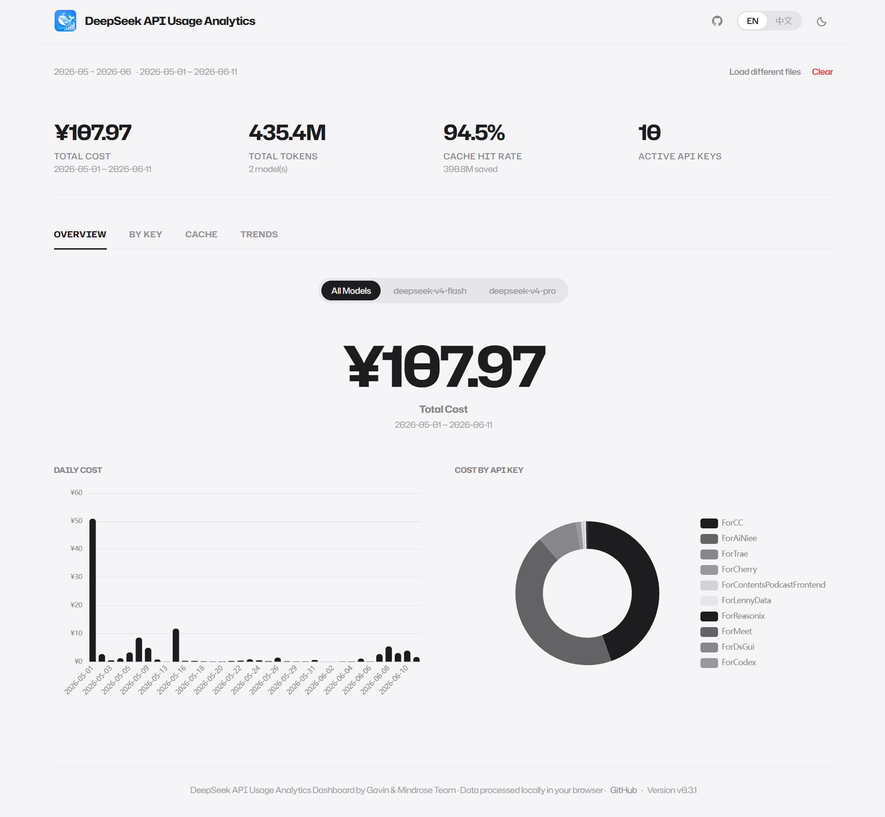

# Agnes AI Usage Analytics Dashboard by Gavin & Mindrose Team

<p align="center">
  
</p>

A browser-side analytics dashboard for Agnes AI usage. Upload a single Agnes usage CSV and get instant cost, token, request, and per-key analytics in your browser. No server, no upload, no signup.

> [中文版](README_zh.md)

## How It Works

1. Export a usage CSV from Agnes AI.
2. Upload the CSV to the dashboard.
3. Review the Overview, By Project, By Key, and Trends views.
4. Everything stays in the browser and is processed locally.



## Current Scope

- **Single CSV input** — Agnes export is a single usage CSV. No ZIP extraction and no amount/cost file pairing.
- **Success-only counting** — Only rows with `Consumption Status=success` are included in analytics.
- **Four dashboard tabs** — `Overview`, `By Project`, `By Key`, `Trends`.
- **Model filter** — Filter all views when the CSV contains two or more models.
- **Custom projects** — Group secret keys into your own projects with browser-local config.
- **Share cards** — Generate 1200x630 images for each dashboard tab.
- **Privacy-first** — All parsing and rendering runs locally in the browser.
- **Light/Dark themes** — Theme-aware charts, layout, and share cards.
- **Bilingual UI** — English and Chinese translations across pages and docs.

## CSV Format

The current parser expects the Agnes usage export columns below:

| Column | Meaning |
| --- | --- |
| `Type` | Usage record type |
| `Secret Key Name` | Secret key label shown in the dashboard |
| `Consumption Model` | Model name |
| `Consumption Amount(cents)` | Raw charge value from Agnes export |
| `Consumption Quantity` | Token summary such as `input:123/output:45` |
| `Consumption Time` | Call timestamp |
| `Consumption Status` | Record status, only `success` is counted |

## Key Behaviors

- `Consumption Quantity` is parsed into input/output tokens.
- `Consumption Amount(cents)` is aggregated as cost in yuan by dividing by `100`.
- Rows with non-`success` status are ignored and surfaced as warnings.
- Empty files, missing columns, malformed amounts, and invalid timestamps raise parse errors.

## Development

```bash
npm install
npm run dev
npm test
npm run build
```

## Tech Stack

- Next.js 16 App Router with static export
- React 19
- TypeScript 5
- Tailwind CSS v4
- Papa Parse
- ECharts 6 + `echarts-for-react`
- html2canvas
- qrcode
- Vitest + Testing Library

## Project Notes

- App version is `0.1.0`.
- Default site URL fallback changed to `https://agnes-usage.xyz`.
- The public GitHub link changed to `https://github.com/GavinCnod/agnes-api-usage-analysis`.
- These external addresses are intentionally kept for now and are not part of this migration pass.
