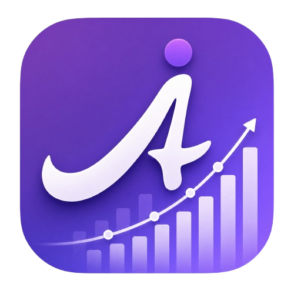
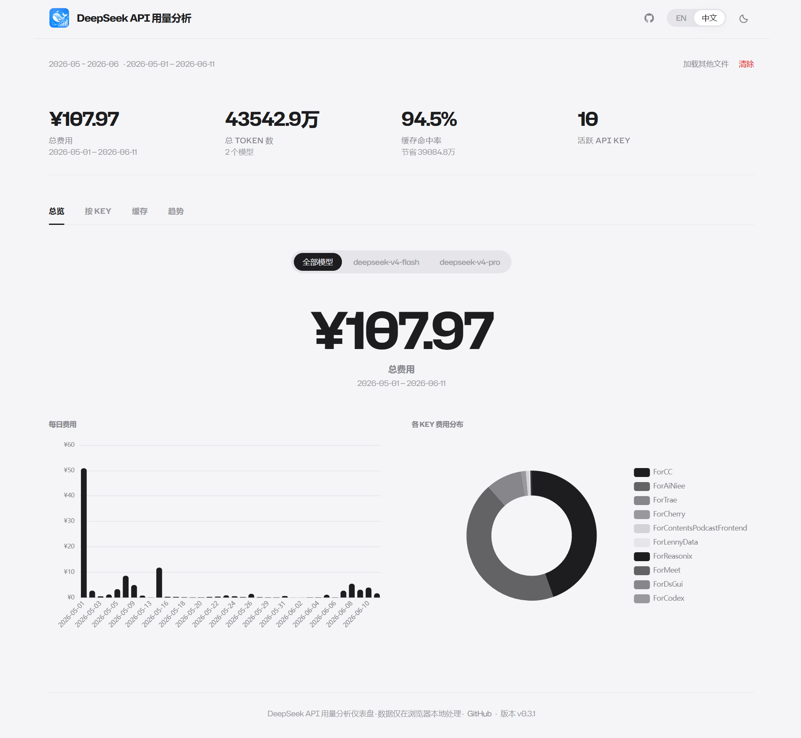

# Agnes AI 用量分析仪表盘 by Gavin & Mindrose Team

<p align="center">
  
</p>

一款纯浏览器端的 Agnes AI 用量分析仪表盘。上传单个 Agnes 用量 CSV，即可在本地浏览器中即时查看费用、Token、请求量和按 Key 的统计。无需服务器、无需上传、无需注册。

> [English version](README.md)

## 使用方式

1. 从 Agnes AI 导出用量 CSV。
2. 将该 CSV 上传到仪表盘。
3. 查看总览、按项目、按 Key 和趋势四个视图。
4. 所有数据都只在浏览器本地处理。



## 当前范围

- **单文件输入**：Agnes 当前导出为单个用量 CSV，不需要 ZIP 解压，也不需要 amount/cost 双文件配对。
- **只统计 success**：仅纳入 `Consumption Status=success` 的记录。
- **四个核心标签页**：`总览`、`按项目`、`按 Key`、`趋势`。
- **模型筛选**：当 CSV 中存在两个及以上模型时，可对所有视图按模型过滤。
- **自定义项目分组**：可将 Secret Key 本地分组到自定义项目中。
- **分享卡片**：可为每个仪表盘视图生成 1200x630 分享图片。
- **隐私优先**：所有解析与渲染都在浏览器本地完成。
- **浅色 / 深色主题**：图表、布局和分享卡均支持主题联动。
- **中英双语**：页面和说明文档均支持中英文。

## CSV 格式

当前解析器要求 Agnes 用量 CSV 至少包含以下列：

| 列名 | 含义 |
| --- | --- |
| `Type` | 记录类型 |
| `Secret Key Name` | 仪表盘中展示的 Secret Key 名称 |
| `Consumption Model` | 模型名称 |
| `Consumption Amount(cents)` | Agnes 导出中的原始费用值 |
| `Consumption Quantity` | 形如 `input:123/output:45` 的数量串 |
| `Consumption Time` | 调用时间 |
| `Consumption Status` | 记录状态，仅统计 `success` |

## 关键行为

- `Consumption Quantity` 会被拆分为 input/output token。
- `Consumption Amount(cents)` 会通过除以 `100` 聚合为当前展示使用的费用数值。
- 非 `success` 状态的记录会被忽略，并以 warning 形式提示。
- 空文件、缺列、金额格式错误、时间字段非法等情况会直接报解析错误。

## 本地开发

```bash
npm install
npm run dev
npm test
npm run build
```

## 技术栈

- Next.js 16 App Router + 静态导出
- React 19
- TypeScript 5
- Tailwind CSS v4
- Papa Parse
- ECharts 6 + `echarts-for-react`
- html2canvas
- qrcode
- Vitest + Testing Library

## 版本说明

- `v0.1.1`：围绕三维核心指标继续打磨，`Overview` / `Trends` 改为相对对比图，分享卡补充静态最高/最低标注，统一 KPI 文案，简化 Hero 布局，并同步将所有面向发布的版本说明更新到 `0.1.1`。
- `v0.1.0`：将产品从早期 DeepSeek 用量分析项目迁移为 Agnes 单 CSV 工作流，移除 Cache 时代语义，并按 Agnes 分析体验重写界面、SEO 与文档。

## 项目说明

- 当前应用版本为 `0.1.1`。
- 站点默认 URL fallback 已经改为 `https://agnes-usage.xyz`。
- 对外 GitHub 链接已经改为 `https://github.com/GavinCnod/agnes-api-usage-analysis`。 
- 这些外部地址是当前阶段刻意保留的边界，不在本轮 Agnes 迁移里替换。
